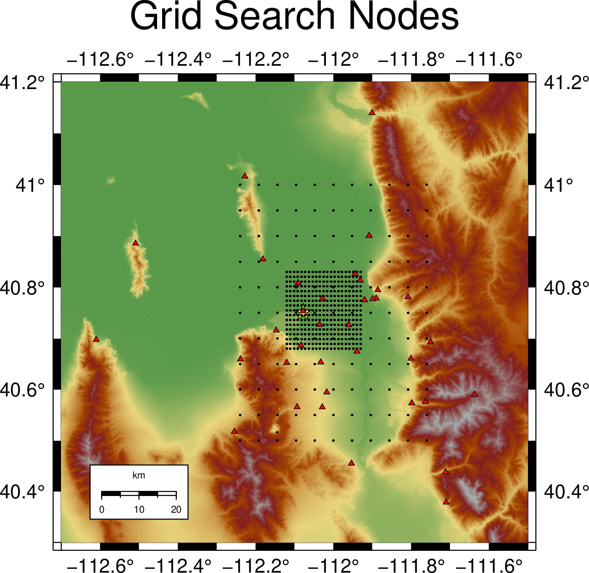

# Overview

This is an example of associating data from the 2020 Magna, Utah 5.7 aftershock sequence.

## Step 1: Travel Time Tables

To begin we must generate travel time tables.  For simplicitly we will use a  1D model and the travel time calculator from [GrowClust](https://github.com/interseismic/PhaseLink/blob/master/raytracer.tar.gz).  Since I do not know the licensing it will be up to you to download, compile, and make an executable named make\_TTable.

The velocity model in wasatch.txt is used by the UUSS for events in the Wasatch Front.  The file is defined by depth (km), Vp (km/s), Vs (km/s) tuples

     0.0  3.40 1.95
    5.04  5.90 3.39
    20.6  6.40 3.68
    31.5  7.50 4.31
    45.5  7.90 4.54

Note, that this model has been modified so that 0 is actually 1.5 kilometers above sea-level.

Next, we run GrowClust's travel time calculator with the following script

    #!/bin/bash
    ttimes_growclust=make_TTable
    velocity_model="wasatch.txt"
    p_ttable="TT.wasatch.pg"
    s_ttable="TT.wasatch.sg"
    pphase=1
    sphase=2
    kmsec=1
    # Table depth spacing: Min/Max/Increment
    depth_spacing="0.0 40.0 0.5"
    # Table distance spacing: Min/Max/Increment
    distance_spacing="0 200 1"
    # Background vp/vs
    vpvs=1.74
    # Ray parameter bound - we use 32 km as the mangle which corresponds
    # to 1/7.5 and 1/4.31 as seen in the following 2 lines 
    noPn=0.133
    noSn=0.238
    # First column is depth
    vmodel_first_column_format=1
    # Read the velocity model into a
    n_lines_in_model=5
    # Read the file
    vmodel=`cat ${velocity_model}`
    n_lines_in_model=`wc -l ${velocity_model}`
    echo "$vmodel"

    ${ttimes_growclust} << EOF
    ${p_ttable}
    ${pphase}
    ${kmsec}
    ${depth_spacing}
    ${distance_spacing}
    ${vpvs}
    ${noPn}
    ${velocity_model}
    ${vmodel_first_column_format}
    ${n_lines_in_model}
    ${vmodel}
    EOF

    ${ttimes_growclust} << EOF
    ${s_ttable}
    ${sphase}
    ${kmsec}
    ${depth_spacing}
    ${distance_spacing}
    ${vpvs}
    ${noSn}
    ${velocity_model}
    ${vmodel_first_column_format}
    ${n_lines_in_model}
    ${vmodel}
    EOF

After creating the travel time tables we will repackage them into a 3D point cloud for use by the associator.  To do this run

    ttables

in the build directory.
    
The result will be an HDF5 archive which contains travel time fields at nodes.  In plan the view the result looks like

    
# Associate

After the travel time tables have been computed we associated with

    mpirun -np n associate 

in the build directory where n is the number of processes you wish to use.  The source may have to be modified so that it processes all days.  Basically the issues is that during the COVID era I have to VPN to a server and the connection expires after 12 hours.

# Generate Files for HypoInverse2000

Next the associations must be repackaged in a format for HypoInverse2000.  This can be done by running 

    arr2arc

in the build directory.

# Location

Descend into magna/locate and locate with

    runloc.sh

Note, you might have to adjust the number of files in the loop.

Following this, concatenate the results from hypo into a CSV which will make our subsequent life easier by relying on CSV instead of some arcane format.

    arc2catalog.py

Again, you might have to adjust the number of files in the loop.

After creating a catalog you can recompute statics

    statics.py

This is elegant and requires some tap dancing with respect to the locarc2000 file's _setstation_ variable.  If you are using statics I recommend

    1.  Note the updated station file produced by statics.py
    2.  Update _setstation_ in the locarc2000 file.
    3.  Rerun _runloc.sh_ and _arc2catalog.py_.
    4.  Possibly update _../associator.cpp_ and rerun.  This may result in the associator being able to scrounge more picks together.

